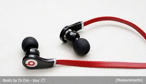

<!DOCTYPE html>
<html lang="ko">
<head>
    <meta charset="UTF-8"></meta>
    <tittle>자기소개서 작성</tittle>
</head>

<body>
 <h1 id="메뉴"> 메뉴 </h1>
 <a href ="#간단한 자기소개"> 간단한 자기소개 </a>  
 <a href = "#취미"> 취미</a>  
 <a href = "#시간표"> 시간표 </a>  
 <a href = "#댓글 남기기"> 댓글 남기기 </a>
  
  
 <h1 id="간단한 자기소개">간단한 자기소개</h1>
 
<b> 이름 : 이진명 </b> 

 
 <b> 전공 : 한성대학교 </b> IT응용시스템공학과

 
 <b> 사는 곳 : 경기도 구리시 </b> 

 
 
 <b>나에게 어울리는 음악 : beWhy-중2병 </b> 

 <audio src="중2병.mp3" controls="controls"> </audio>
  
  
 <a href ="#메뉴"> 메뉴로 돌아가기</a>
  
  
 <h1 id="취미"> 취미 </h1>
<ul>
    <li> 음악 듣기 </li>
    
    <li> 배드민턴 치기</li>
    
    <li> 여행가기 </li>
    
     
     
    <a href ="#메뉴"> 메뉴로 돌아가기</a>
</ul>
  
  
 <h1 id="시간표"> 시간표 </h1>
 
<b> 2016년 1학기 과목 </b>

 <ul>
     <li>C프로그래밍</li>
     <li>영상정보의 이해</li>
     <li>웹프로그래밍</li>
     <li>일반물리1</li>
     <li>인간관계의 이해</li>
     <li>영어커뮤니케이션 청취/회화</li>
     <li>사고와 표현</li>
     <li>소프트웨어의 이해</li>
 </ul>
 
  
 
<b>시간표</b>

 <table border="1">
     <thead>
     <tr>
         <th></th>
         <th>월</th>
         <th>화</th>
         <th>수</th>
         <th>목</th>
         <th>금</th>
     </tr>
     </thead>
     <tbody>
     <tr>
         <td>1교시 9:00~9:50</td>
         <td></td>
         <td rowspan="2">웹프로그래밍
         </td><td>
         <td>영어커뮤니케이션 청취/회화</td>
         <td></td>
     </tr>
     <tr>
         <td>2교시 10:00~10:50</td>
         <td></td>

         <td rowspan="2">영어커뮤니케이션 청취/회화</td>
         <td></td>
         <td rowspan="2">소프트웨어의 이해</td>
     </tr>
     <tr>
         <td>3교시 11:00~11:50</td>
         <td></td>
         <td rowspan="2">일반물리1</td>
         <td></td>
     </tr>
     <tr>
         <td>4교시 12:00~12:50</td>
         <td></td>
         <td></td>
         <td>웹프로그래밍</td>
         <td></td>
     </tr>
     <tr>
         <td>5교시 1:00~1:50</td>
         <td></td>
         <td></td>
         <td rowspan="2">사고와 표현</td>
         <td></td>
         <td></td>
     </tr>
     <tr>
         <td>6교시 2:00~2:50</td>
         <td></td>
         <td></td>
         <td></td>
         <td></td>
     </tr>
     <tr>
         <td>7교시 3:00~3:50</td>
         <td>C프로그래밍</td>
         <td></td>
         <td></td
         ><td></td>
         <td></td>
     </tr>
     <tr>
         <td>8교시 4:00~4:50</td>
         <td rowspan="2">영상정보의 이해</td>
         <td rowspan="2">인간관계의 이해</td>
         <td rowspan="2">C프로그래밍</td>
         <td></td>
         <td></td>
     </tr>
     <tr>
         <td>9교시 5:00~5:50</td>
         <td></td>
         <td></td>
     </tr>
     </tbody>
 </table>
  
  
 <
 <a href ="#메뉴"> 메뉴로 돌아가기</a>

 
<h1 id="댓글 남기기"> 댓글 남기기 </h1>
<form>
    <legend> 입력 양식 </legend>
    <table>
        <td></td>
    </table>
</form>
</body>
</html>
